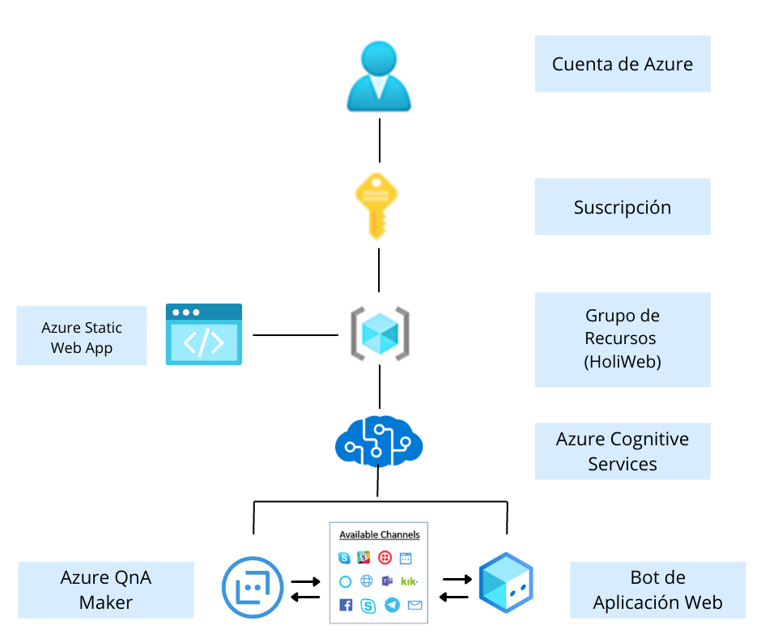

# HOLI WEB

### Descripción del Proyecto a Entregar (Corta)
Una página web con un Inteligencia Artificial (chatbot) que te permite obtener información de los diversos lugares turísticos que existen en el país, con la finalidad de modernizar y promover el turismo y así contar con información oportuna y veraz que permita la toma de decisiones estratégicas para la sociedad civil, los inversionistas, el sector académico y el gobierno. ​
___
### Link al Tiktok

___
### Diagrama de Azure

___
### SLA Compuesto

| Servicio  | Contrato de nivel de servicio | 
| --------- | --------- | 
| Azure Cognitive Service | 99,9% | 
| Azure Bot Services | 99,9%  | 
| QnA Maker | 99,9% | 
| Static Web App | 99,95% | 

        99,9%×99,9%×99,9%×99,95%

      = 0,999×0,999×0,999×0,9995

      = 0,9965

      = 99,65%


### TCO 3 años y Precio Total por mes


___
### Tiempo sin disponibilidad a un año
| Porcentaje de acuerdo de nivel de servicio	| Tiempo de inactividad por semana	| Tiempo de inactividad por mes	| Tiempo de inactividad por año
| --| ---| ---| ---| 
99	| 1,68 horas	| 7,2 horas	| 3,65 días

Al obtener un SLA compuesto de 99,65%, concluimos que el tiempo sin disponibilidad en un año es de 3,65 días aproximadamente.

___
### Qué te pareció el evento
```
Buen desarrollo pero siento que falto un poco de organización, por lo demás fue una buena experiencia y nos dejo bastante aprendizaje.
- Belem Yañez
```

```
Me pareció algo desorganizado, debido a que no había un itinerario que nos permitiera orientar en que momentos se realizaban las mentorías o la disponibilidad de los mismos mentores, así cómo recibir información respecto a los entregables que se harían. Pero en general fue una buena experiencia para apreder y reforzar los conocimientos de Azure.
- Ángel García
```
